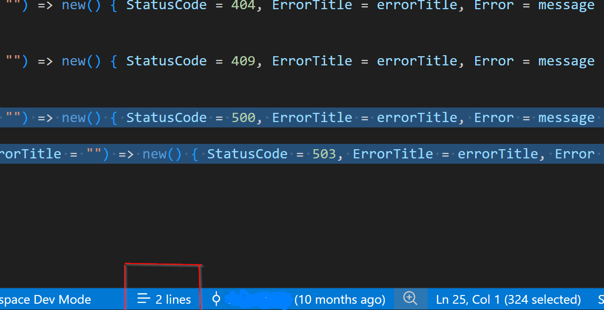

# Selected Lines Counter

Selected Lines Counter shows the number of selected lines directly in the Visual Studio Code status bar.

## Features

- Shows the selected line count in the status bar
- Updates immediately when the selection changes
- Supports multiple selections
- Avoids double-counting overlapping selections
- Handles selections ending at column 1 of the following line
- Hides automatically when nothing is selected
- Requires no configuration

## Usage

Select one or more lines in the editor. The status bar displays the number of selected lines, such as `12 lines`.

## Screenshots



## Development

```bash
npm install
npm run compile
```

Press `F5` in VS Code to launch an Extension Development Host.

## Package

```bash
npm run package
```

Before publishing, replace `YOUR-PUBLISHER-ID` in `package.json` with your Visual Studio Marketplace publisher ID.

## Release Notes

See [CHANGELOG.md](CHANGELOG.md).

## License

MIT
